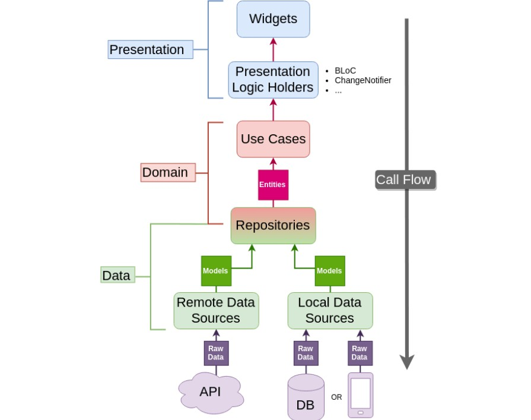

# Flutter Clean Architecture Template

This Flutter application follows the principles of Clean Architecture to provide a scalable, maintainable, and testable
codebase. The architecture is organized into three main layers: Domain, Data, and Presentation. Flutter_Bloc is employed
for state management, ensuring a reactive and efficient user interface.

## Architecture Overview

Clean Architecture divides the application into three main layers:

1. **Domain Layer**: Contains the business logic and entities of the application.
2. **Data Layer**: Manages data retrieval and storage. It includes repositories, data sources, and mappers.
3. **Presentation Layer**: Handles user interface logic, including UI components, presenters, and view models.

This separation ensures that each layer has distinct responsibilities, making the codebase modular and easy to maintain.

## Project Structure

# Flutter Clean Architecture App

## Overview

This Flutter application follows the principles of Clean Architecture to provide a scalable, maintainable, and testable
codebase. The architecture is organized into three main layers: Domain, Data, and Presentation. Flutter_Bloc is employed
for state management, ensuring a reactive and efficient user interface.



## Table of Contents

- [Architecture Overview](#Architecture-Overview)
- [Project Structure](#project-structure)
- [Domain Layer](#Domain-Layer)
- [Data Layer](#data-layer)
- [Presentation Layer](#presentation-layer)
- [State Management with Flutter_Bloc](#state-management-with-flutter_bloc)
- [Dependencies](#dependencies)

### Architecture Overview

Clean Architecture divides the application into three main layers:

1. **Domain Layer**: Contains the business logic and entities of the application.
2. **Data Layer**: Manages data retrieval and storage. It includes repositories, data sources, and mappers.
3. **Presentation Layer**: Handles user interface logic, including UI components, presenters, and view models.

This separation ensures that each layer has distinct responsibilities, making the codebase modular and easy to maintain.

The project is organized into `core`, `data`, and `presentation` directories, reflecting the Clean Architecture layers.

## Folder structure

```
app/
   |- config/
   |- constants/
   |- errors/
   |- models/
   |- extensions/
   |- routes/
   |- services/
|- data/
      |-module
        |- data-sources/
             |- local/
             |- network/ 
        |- repositories/  
            
|- domain/
      |- module
        |- entities/
        |- repositories/
        |- usecases/
|- presentation/
      |- modules
        |- widgets/
        |- page/
        |- bloc/        
```

### Domain Layer

In Clean Architecture, the domain layer is one of the key components that represents the core business logic and rules of an application. Clean Architecture is a software design philosophy introduced by Robert C. Martin, also known as Uncle Bob. It aims to create modular and maintainable software by organizing code into distinct layers, with clear boundaries and dependencies.

The domain layer, sometimes referred to as the "core" or "business logic" layer, is positioned at the center of the architecture. It is isolated from external concerns such as frameworks, databases, or user interfaces. The purpose of the domain layer is to encapsulate the business rules and entities, providing a representation of the problem domain without being coupled to the details of external technologies.

Key characteristics of the domain layer in Clean Architecture include:

Independence: The domain layer should not depend on any external frameworks, libraries, or tools. It should be isolated and independent, allowing it to be tested and developed without being tied to specific implementation details.

Entities: The domain layer defines entities, which are objects representing core concepts in the business domain. These entities encapsulate the business rules and state.

Use Cases/Interactors: The domain layer contains use cases or interactors that represent the application's business logic. Use cases encapsulate the flow of operations that the application can perform to achieve specific goals.

Business Rules: The domain layer houses the business rules of the application. These rules govern how data is processed, validated, and manipulated to achieve the desired outcomes.

Domain Services: Sometimes, the domain layer includes domain services, which are reusable components that provide specific functionalities needed by the business logic.

Agnostic to Frameworks and UI: The domain layer does not have dependencies on specific UI frameworks or external technologies. It is designed to be technology-agnostic, making it easier to adapt to changes in the external layers.

By separating the domain layer from the infrastructure and presentation layers, Clean Architecture aims to create a flexible and maintainable codebase. Developers can modify or replace external components without affecting the core business logic, and changes in business rules can be implemented without impacting the external layers of the application. This separation also facilitates unit testing of the business logic in isolation from external dependencies

## Data Layer

The Data Layer is responsible for interacting with data sources, such as databases, external services, and 
repositories. It encapsulates the details of how data is stored and retrieved, shielding the rest of the application from the specific implementation details of the data storage mechanisms.

Here are some key characteristics and responsibilities of the Data Layer in Clean Architecture:

Persistence Logic: The Data Layer contains the code responsible for interacting with databases or other data storage mechanisms. This includes CRUD (Create, Read, Update, Delete) operations and any specific logic related to data persistence.

Repositories: The Data Layer often includes repository interfaces or classes that define the contract for accessing and manipulating data. These interfaces are implemented by concrete repository classes, and they are used by the Use Cases (Application Layer) to interact with the data.

External Services: If the application communicates with external services or APIs, the Data Layer is where the code for making requests and handling responses is located. This helps in isolating external dependencies and makes it easier to swap or update external services without affecting the rest of the application.

Data Mapping: The Data Layer may also include components for mapping data between the application's domain model and the data storage format. This ensures that the internal representation of data in the application remains separate from its external representation.

Frameworks and Libraries: The Data Layer may utilize specific frameworks or libraries for database access, networking, or other data-related operations. These dependencies are confined to the Data Layer, reducing the impact of changes in these technologies on the rest of the application.

By separating the Data Layer from the other layers, such as the Domain Layer and the Application Layer, Clean Architecture promotes a modular and flexible design. It allows developers to change or upgrade the data storage implementation without affecting the core business logic or the user interface.

## Presentation Layer

This layer handles the user interface and is divided into blocs, pages, and widgets. BLoC (Business Logic Component) is
used to manage the application state efficiently.

the Presentation Layer is one of the concentric circles or layers that make up the overall architecture. This layer is responsible for handling user interface concerns and interacting with the user. It is designed to be independent of the application's business logic and data access details, promoting separation of concerns and maintainability.

Key characteristics and responsibilities of the Presentation Layer in Clean Architecture include:

User Interface (UI): The Presentation Layer contains the code related to the user interface components, such as views, screens, and widgets. This could include web pages, mobile app screens, desktop interfaces, or any other form of interaction with the end user.

User Input Handling: The layer is responsible for capturing user input, such as button clicks, form submissions, or gestures. It processes user actions and triggers appropriate actions in the underlying layers of the application.

ViewModels or Presenters: In some architectures, the Presentation Layer includes components like ViewModels or Presenters. These components handle the presentation logic, formatting data for display, and interacting with the underlying layers to retrieve or update information.

UI Business Logic: While the core business logic resides in the inner layers (Domain Layer and Application Layer), the Presentation Layer may contain specific business logic related to the user interface. For instance, it might involve handling UI-specific validations, formatting, or user experience-related logic.

Dependency on Application Layer: The Presentation Layer depends on the Application Layer to request and perform business operations. It interacts with the Use Cases (Interactors) provided by the Application Layer without directly accessing the underlying data sources or the domain logic.

Frameworks and UI Libraries: The Presentation Layer may use specific frameworks, libraries, or UI components to implement the user interface. These dependencies are isolated within the Presentation Layer, making it easier to change or upgrade the UI technology without affecting the rest of the application.

Clean Architecture encourages keeping the Presentation Layer as thin as possible, delegating most of the business logic to the inner layers. This separation ensures that changes in the user interface or presentation logic have minimal impact on the core application functionality. It also facilitates testing by allowing the business logic to be tested independently of the user interface.


## State Management with Flutter_Bloc

Flutter_Bloc is utilized for state management. BLoCs handle the business logic and state changes in a reactive manner,
providing a clean and predictable way to manage the UI.

In Flutter, the BLoC (Business Logic Component) pattern is a design pattern for managing state in an application in a clean and scalable way. The flutter_bloc library is a package that provides tools and utilities to implement the BLoC pattern easily.

Here are the key concepts and components associated with the flutter_bloc library:

BLoC: A BLoC is a class or component that manages the business logic of a particular part of your application. It handles state management, responds to events, and updates the user interface accordingly.

Events: Events are occurrences or triggers that can lead to a state change in your application. In the context of BLoC, events are dispatched to the BLoC, which then processes them and updates the state accordingly.

States: States represent the current state of your application or a particular part of it. In response to events, a BLoC emits new states, and the UI is updated based on these states.

BlocProvider: BlocProvider is a widget provided by the flutter_bloc library that allows you to inject instances of BLoCs into your widget tree. It ensures that the BLoCs are properly disposed of when they are no longer needed.

BlocBuilder: BlocBuilder is another widget from the library that simplifies the process of rebuilding parts of your UI in response to state changes in a BLoC. It takes a BLoC and a callback function, and it automatically rebuilds its child widget whenever the BLoC emits a new state.

BlocListener: Similar to BlocBuilder, BlocListener is a widget used for reacting to state changes in a BLoC. It allows you to execute side effects, such as navigating to a new screen or showing a dialog, in response to state changes.

BlocConsumer: This widget combines the functionality of BlocBuilder and BlocListener. It rebuilds parts of the UI and executes side effects in response to state changes.

By using the BLoC pattern and the flutter_bloc library, you can structure your Flutter applications in a way that separates business logic from the UI, making it easier to test, maintain, and scale your codebase. It's particularly useful for handling complex state management scenarios in applications

## Getting Started

1. Clone the repository.
2. Run `flutter pub get` to install dependencies.
3. Start the application using `flutter run`.

## Dependencies

- [Flutter](https://flutter.dev/)
- [flutter_bloc](https://bloclibrary.dev/)
- [go-router](https://pub.dev/packages/go_router)
- [get-it](https://pub.dev/packages/get_it)

For a complete list of dependencies, refer to the `pubspec.yaml` file.

## How to Use

**Step 1:**

Use this template and make your own repository using this template.

**Step 2:**

Go to project root and execute the following command in console to get the required dependencies:

```
flutter pub get 
```

**NOTE**: Don't forget to change the 'app name' and 'package name' in android, ios and pubspec files.
